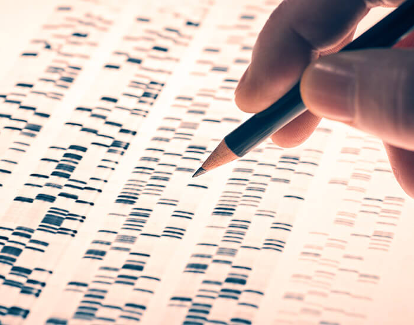

# Genomics Data Science
 

Ever since, Crick, Watson and Franklin discovered the bits (or is it quits :) of the genetic code - Adenosine ,Thymine, Guanine and Cytosine , the approach to Genomic analysis has changed. Ever since the Human Genome Project gave us the reference genome, data analytics has shifted to approaching the genome as a long string of characters (computationally) and assess how various reads align themselves to the reference genome through various naive or partial matching of various reads to the reference genome.
This is my exploration of understanding Genomics as a use case for data science

Contents:
<ul>
 <li>Genomics Data Specialization - Code representations of various DNA sequencing algorithms</li>
